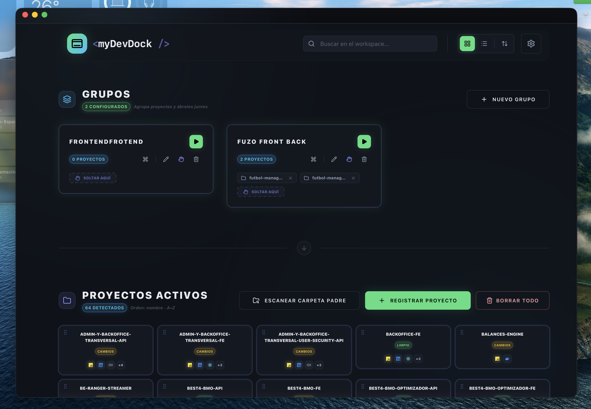
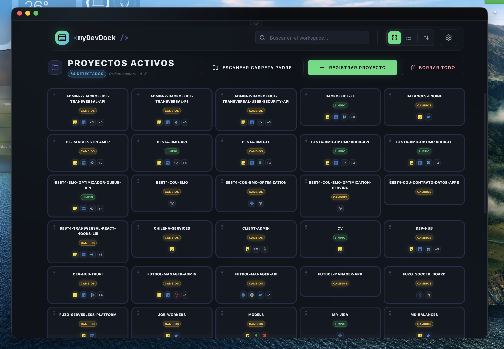

# myDevDock



**myDevDock** is a **desktop hub** for local development folders: register repos, scan parent paths with monorepo-aware logic, see Git and stack signals at a glance, and open everything in your preferred editor—alone, in **groups**, or via **Raycast** scripts you generate from the UI.

Built with **Tauri v2**, **React 19**, and **Rust**. All data stays on your machine; no cloud account.

---

## In practice

The flows below mirror how you actually use the app: from browsing what you have registered, to opening a set of repos together, to reusing that same open sequence from Raycast. *The two animations at the end of this section are large files and can take a few seconds to appear.*

### Rich cards for each repo

See stacks, Git branch and status, and shortcuts without digging through Finder.



### One action opens a whole group

Bundle projects (for example “frontend + API + docs”), then launch them all in your default editor with an optional delay between windows—useful when you always start the same set of services.


### The same paths from Raycast

Export a Script Command once per project or group; from Raycast you trigger the same opens in the editor you chose in myDevDock.


---

## Features

| Area | Capability |
|------|------------|
| **Projects** | Register folders manually or **scan a parent directory** (depth-limited walk). |
| **Smart scan** | Treats **one workspace root** per monorepo (Nx, Turborepo, pnpm/npm **workspaces**, Lerna, Rush, **Melos**, Cargo **`[workspace]`**, **Go** `go.work`, **Bazel** roots). Does not register every inner `apps/*` / `packages/*` package. After a match, **stops descending** that tree. |
| **Git** | Branch, last commit message, **last commit timestamp (ISO)** for sorting, uncommitted change count, status for UI (clean / uncommitted / …). |
| **Stacks** | Heuristic detection from `package.json`, `Cargo.toml`, `go.mod`, Python files, etc. |
| **Editors** | Open project path in Cursor, VS Code, Zed, WebStorm, Sublime, Neovim, Antigravity; default editor + per-launch picker. **Probable editor** hint from `.cursor`, `.vscode`, etc. |
| **Usage sort** | **`lastOpenedAt`** when opened from the hub; sort also by name, date added, **Git commit time**, Git status. Settings persisted in Rust JSON state. |
| **Groups** | Create groups, assign projects (incl. drag-and-drop), **launch all** with configurable delay. |
| **Raycast** | Configure a Script Commands folder once, then generate `.sh` launchers per **project** or **group** from the UI. Scripts target your chosen editor (with a macOS `open -a` fallback when the CLI is not on Raycast’s PATH). Removing a project or group removes its stored launcher file when applicable. |
| **UI** | Neon / glass aesthetic; **multiple UI themes** (`data-theme` + CSS variables in `src/styles.css`). **i18n** via `react-i18next`. |
| **Multi-window** | Separate settings UI path; **Tauri events** sync **theme** and **app settings** across webviews instantly. |
| **Persistence** | Single JSON file under the app data directory (projects, groups, settings). |
| **Dev without desktop** | `bun run dev` uses **mock** services when `window.__TAURI__` is missing. |

---

## Tech stack

- **Package manager**: [Bun](https://bun.sh) (`bun install`, `bun run …`)
- **Frontend**: Vite 6, TypeScript, Tailwind CSS v4, Zustand, Framer Motion, dnd-kit, Lucide
- **Desktop**: Tauri 2, Rust 2021 (`src-tauri/`)

## Quick start

```bash
bun install

# Web only (mocks, no Rust)
bun run dev

# Full desktop app
bun run tauri dev

# Production web build
bun run build

# Desktop release bundle
bun run tauri build
```

Rust check:

```bash
cd src-tauri && cargo check
```

## Repository layout (short)

| Path | Role |
|------|------|
| [`src/app/`](src/app/) | App shell, dashboard, groups, projects, layouts |
| [`src/lib/`](src/lib/) | Shared UI kit (`@org/ui-kit`), models alias `@org/models`, services `@org/services`, theme/sort helpers |
| [`src-tauri/src/lib.rs`](src-tauri/src/lib.rs) | Tauri commands, scan logic, persistence, Git/stack detection |
| [`docs/`](docs/) | Human + **AI-oriented** docs ([`docs/00-ai-brief.md`](docs/00-ai-brief.md)) |

## Documentation

- **Index**: [`docs/README.md`](docs/README.md)
- **AI / agents quick brief**: [`docs/00-ai-brief.md`](docs/00-ai-brief.md)
- **Editor rules**: [`AGENTS.md`](AGENTS.md), [`CLAUDE.md`](CLAUDE.md)

## License

[MIT](LICENSE) — Copyright (c) 2026 Luis Eduardo Farfán Melgar.
